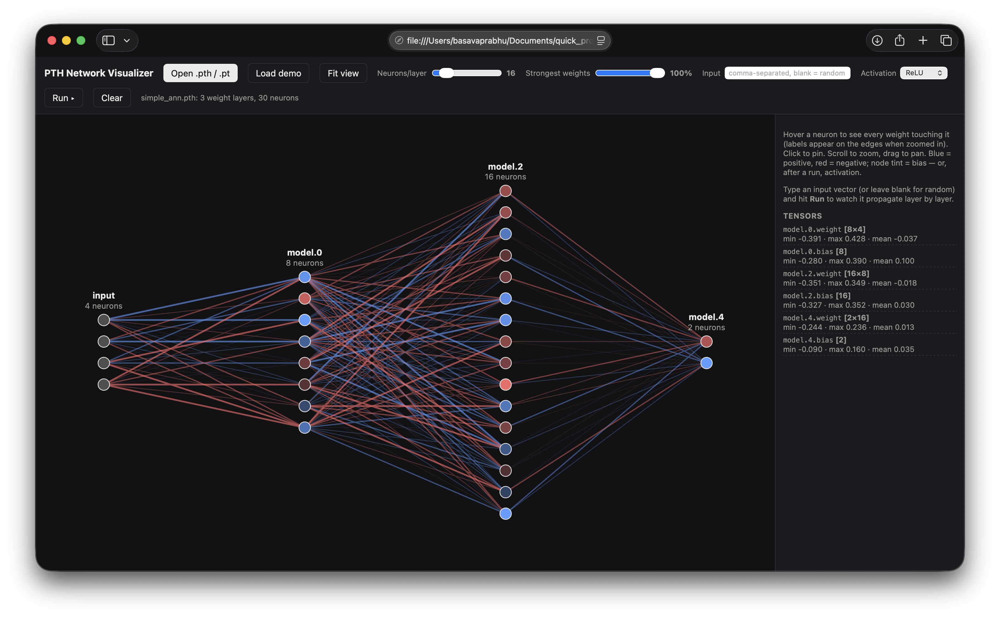
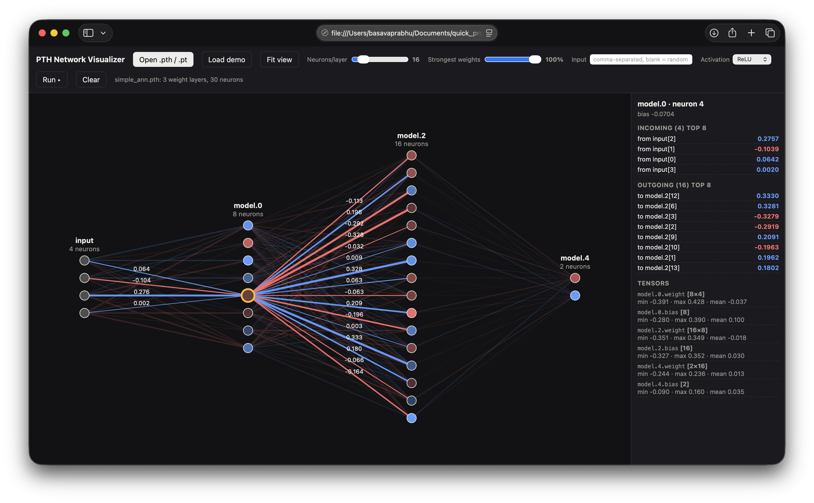
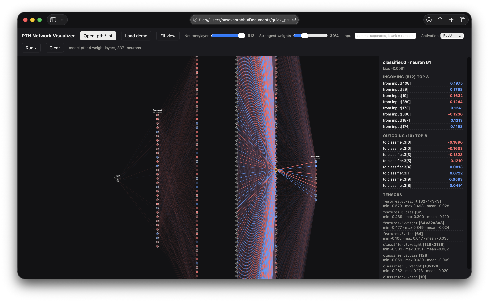

# NeuralViz

Zero-dependency, single-file visualizer for PyTorch `.pth` checkpoints — right in your browser.

Drop a `state_dict` file and instantly see layers, neurons, weights, biases, and live forward-pass activations. 100% client-side, so your weights never leave your machine.



## GitHub Description (copy-paste into About)

```
NeuralViz — Single-file, offline visualizer for PyTorch .pth checkpoints. Drag & drop a state_dict in your browser to explore layers, weights & biases and watch activations propagate. No install, no server, 100% private.
```

Suggested topics: `pytorch` `neural-network` `visualization` `deep-learning` `machine-learning` `canvas` `single-file` `ml-tools`

## Screenshots

| Overview (small MLP) | Neuron inspect (click to pin) | Large model (3371 neurons) |
|---|---|---|
|  |  |  |

## Features

- **Drag & drop `.pth` / `.pt` / `.bin` / `.ckpt`** — or click `Open .pth / .pt`
- **Parses torch.save zip format in-browser** — minimal pickle VM + `data.pkl` + `data/` storage reader, no backend
- **Layer graph on canvas** — pan (drag), zoom (scroll), `Fit view`
- **Weight coloring** — blue = positive, red = negative, opacity/width = magnitude
- **Neuron inspector** — hover to highlight all touching edges, click to pin, top-8 incoming/outgoing weights + bias
- **Tensor panel** — shape + min / max / mean per tensor
- **Filters** — `Neurons/layer` cap (4–512) + `Strongest weights %` to declutter large nets
- **Forward-pass simulation** — custom input (comma-separated, blank = random), ReLU / tanh / sigmoid / none, animated layer-by-layer pulse + activation heatmap
- **Conv support** — `Conv2d` weights averaged over kernel dims (`[out×in×kH×kW]` → edge strength)
- **Demo mode** — `Load demo` builds a 4→8→6→3 MLP instantly, no file needed
- **Dark / light aware** — follows `prefers-color-scheme`
- **Single file** — just `index.html`, no npm, no build, works from `file://`

## How it works

1. `readZip()` scans the zip central directory (with zip64 + local-header fallback) to list entries.
2. Loads `*.data.pkl` via a tiny pickle opcode VM (`unpickle()`), resolving persistent IDs to `storages`.
3. `decode()` converts Float32 / Float64 / Float16 / BFloat16 / Int / Long storages to `Float32Array`.
4. `extract()` finds the best `state_dict` candidate (prefers `Map`s with `*weight` 2D+ tensors, unwraps full pickled `nn.Module`s via `_parameters` / `_buffers` / `_modules`).
5. `buildModel()` turns each `*.weight [out×in×...]` + `*.bias` into a column of neurons with a `W(o,i)` accessor.
6. Canvas renderer draws only the top-N% strongest edges, with hover/pin highlighting and forward activations.

## Usage

### Option A — just open it
```bash
open index.html
# or
python3 -m http.server 8000
# -> http://localhost:8000
```

### Option B — GitHub Pages (free live demo)
1. Push this folder to GitHub (see below)
2. Repo Settings → Pages → Deploy from branch → `main` / `/ (root)`
3. Open `https://<you>.github.io/NeuralViz/`

### Try it
1. Click **Load demo**, then **Run ▸** to see activations propagate.
2. Or drop your own checkpoint:
```python
torch.save(model.state_dict(), "m.pth")
```
3. Hover a neuron → click to pin → scroll to zoom for weight labels.
4. Type e.g. `0.5,-0.2,0.1,0.8` in Input + pick Activation + **Run**.

## Supported / limitations

Supported:
- `torch.save(model.state_dict())` with PyTorch ≥ 1.6 (zip-based)
- dtypes: float32, float64, float16, bfloat16, int32/64, int16
- MLP + CNN checkpoints (`Linear`, `Conv2d` averaged)

Not supported:
- Legacy pre-1.6 non-zip saves → re-save with modern torch
- Full pickled models (`torch.save(model)` without `state_dict`) — save `state_dict()` instead
- Optimizer states, safetensors (`.safetensors`) — state_dict .pth only

## Project structure

```
NeuralViz/
├── index.html              # entire app (CSS + JS + canvas renderer)
├── README.md
└── screenshots/
    ├── 01-overview.png       # 4→8→16→2 MLP overview
    ├── 02-neuron-inspect.png # pinned neuron + incoming/outgoing weights
    └── 03-large-model.png    # 4-layer, 3371-neuron model, top 30% edges
```

## Upload to GitHub

```bash
cd NeuralViz
git init
git add index.html README.md screenshots/
git commit -m "Initial commit: NeuralViz single-file PTH visualizer"
gh repo create NeuralViz --public --source=. --push
# no gh CLI? -> create empty repo on github.com, then:
# git remote add origin https://github.com/<you>/NeuralViz.git
# git branch -M main
# git push -u origin main
```

## Roadmap ideas

- [ ] Export PNG / SVG of graph
- [ ] Safetensors support
- [ ] Search neuron / tensor by name
- [ ] Side-by-side compare of two checkpoints

## License

MIT — do what you want, attribution appreciated.
